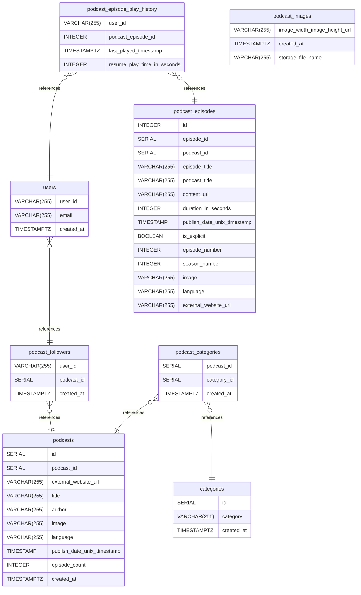

# xtal backend documentation

## Summary

- [Introduction](#introduction)
- [Database Type](#database-type)
- [Table Structure](#table-structure)
  - [podcast_images](#podcast_images)
  - [users](#users)
  - [podcast_episodes](#podcast_episodes)
  - [podcast_episode_play_history](#podcast_episode_play_history)
  - [podcasts](#podcasts)
  - [podcast_categories](#podcast_categories)
  - [podcast_followers](#podcast_followers)
  - [categories](#categories)
- [Relationships](#relationships)
- [Database Diagram](#database-Diagram)

## Introduction

## Database type

- **Database system:** PostgreSQL

## Table structure

### podcast_images

| Name                             | Type         | Settings                 | References | Note |
| -------------------------------- | ------------ | ------------------------ | ---------- | ---- |
| **image_width_image_height_url** | VARCHAR(255) | 🔑 PK, not null, unique  |            |      |
| **created_at**                   | TIMESTAMPTZ  | not null, default: now() |            |      |
| **storage_file_name**            | VARCHAR(255) | not null, unique         |            |      |

### users

| Name           | Type         | Settings                 | References                         | Note |
| -------------- | ------------ | ------------------------ | ---------------------------------- | ---- |
| **user_id**    | VARCHAR(255) | 🔑 PK, not null, unique  | fk_users_user_id_podcast_followers |      |
| **email**      | VARCHAR(255) | null                     |                                    |      |
| **created_at** | TIMESTAMPTZ  | not null, default: now() |                                    |      |

### podcast_episodes

primary key "id" is autoincremented (do not rely on PodcastIndex episode ID, that is external and may change)
description is not stored, could be changed by API as well
| Name | Type | Settings | References | Note |
|-------------|---------------|-------------------------------|-------------------------------|--------------------------------|
| **id** | INTEGER | 🔑 PK, not null, unique, autoincrement | | |
| **episode_id** | SERIAL | not null | | |
| **podcast_id** | SERIAL | not null | | |
| **episode_title** | VARCHAR(255) | not null | | |
| **podcast_title** | VARCHAR(255) | not null | | |
| **content_url** | VARCHAR(255) | not null | | |
| **duration_in_seconds** | INTEGER | not null | | |
| **publish_date_unix_timestamp** | TIMESTAMP | not null | | |
| **is_explicit** | BOOLEAN | not null | | |
| **episode_number** | INTEGER | null | | |
| **season_number** | INTEGER | null | | |
| **image** | VARCHAR(255) | null | | |
| **language** | VARCHAR(255) | null | | |
| **external_website_url** | VARCHAR(255) | null | | |

### podcast_episode_play_history

| Name                            | Type         | Settings                 | References                                                          | Note |
| ------------------------------- | ------------ | ------------------------ | ------------------------------------------------------------------- | ---- |
| **user_id**                     | VARCHAR(255) | 🔑 PK, not null, unique  | fk_podcast_episode_play_history_user_id_users                       |      |
| **podcast_episode_id**          | INTEGER      | 🔑 PK, not null          | fk_podcast_episode_play_history_podcast_episode_id_podcast_episodes |      |
| **last_played_timestamp**       | TIMESTAMPTZ  | not null, default: now() |                                                                     |      |
| **resume_play_time_in_seconds** | INTEGER      | null                     |                                                                     |      |

### podcasts

Tracks podcast information
| Name | Type | Settings | References | Note |
|-------------|---------------|-------------------------------|-------------------------------|--------------------------------|
| **id** | SERIAL | 🔑 PK, not null, unique | | |
| **podcast_id** | SERIAL | not null | | |
| **external_website_url** | VARCHAR(255) | null | | |
| **title** | VARCHAR(255) | not null | | |
| **author** | VARCHAR(255) | null | | |
| **image** | VARCHAR(255) | null | | |
| **language** | VARCHAR(255) | null | | |
| **publish_date_unix_timestamp** | TIMESTAMP | not null | | |
| **episode_count** | INTEGER | null | | |
| **created_at** | TIMESTAMPTZ | not null, default: now() | | |

### podcast_categories

| Name            | Type        | Settings                | References                                   | Note |
| --------------- | ----------- | ----------------------- | -------------------------------------------- | ---- |
| **podcast_id**  | SERIAL      | 🔑 PK, not null, unique | fk_podcast_categories_podcast_id_podcasts    |      |
| **category_id** | SERIAL      | 🔑 PK, not null, unique | fk_podcast_categories_category_id_categories |      |
| **created_at**  | TIMESTAMPTZ | not null                |                                              |      |

### podcast_followers

| Name           | Type         | Settings        | References                               | Note |
| -------------- | ------------ | --------------- | ---------------------------------------- | ---- |
| **user_id**    | VARCHAR(255) | 🔑 PK, not null |                                          |      |
| **podcast_id** | SERIAL       | 🔑 PK, not null | fk_podcast_followers_podcast_id_podcasts |      |
| **created_at** | TIMESTAMPTZ  | not null        |                                          |      |

### categories

| Name           | Type         | Settings                | References | Note |
| -------------- | ------------ | ----------------------- | ---------- | ---- |
| **id**         | SERIAL       | 🔑 PK, not null, unique |            |      |
| **category**   | VARCHAR(255) | not null                |            |      |
| **created_at** | TIMESTAMPTZ  | not null                |            |      |

## Relationships

- **podcast_episode_play_history to users**: many_to_one
- **podcast_episode_play_history to podcast_episodes**: many_to_one
- **users to podcast_followers**: many_to_one
- **podcast_categories to categories**: many_to_one
- **podcast_followers to podcasts**: many_to_one
- **podcast_categories to podcasts**: many_to_one

## Database Diagram

