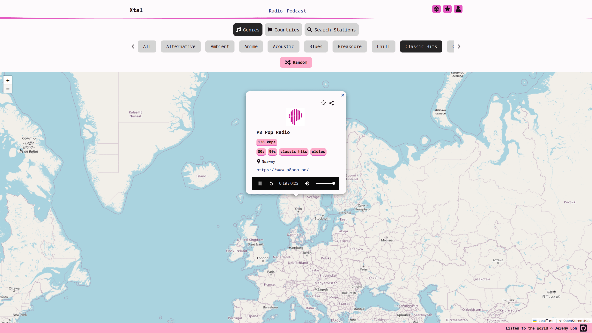
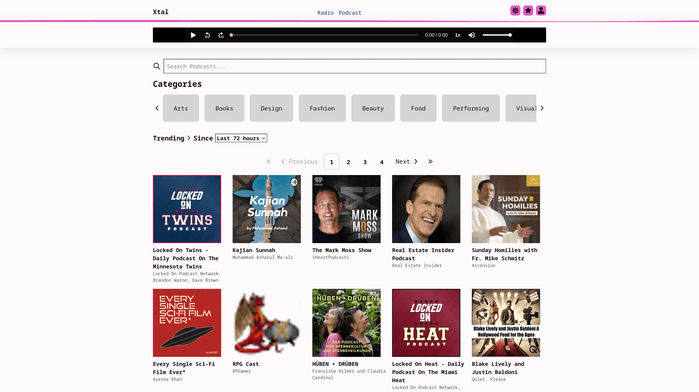
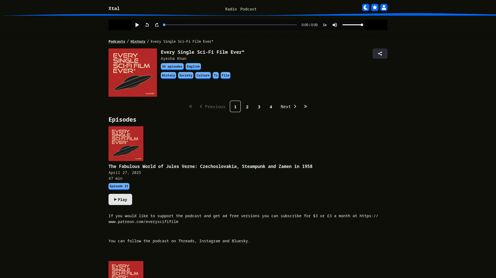
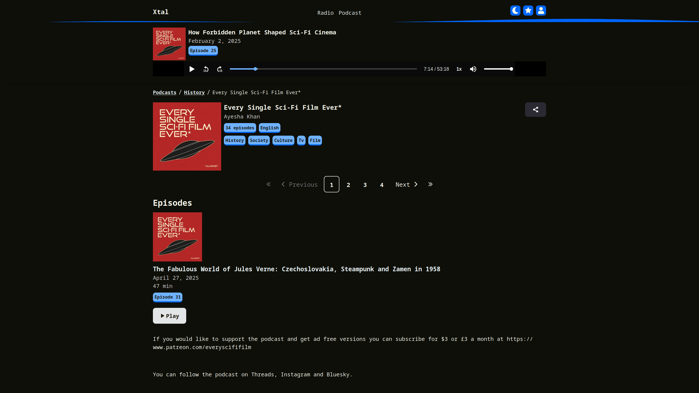

# xtal

[](https://github.com/JeremyLoh/xtal/)

Listen to the world (radio & podcasts) with xtal, a fast and responsive mobile / desktop web application

# Features

- Discover music / radio stations available around the globe
  - Explore different genres of music
  - Search stations by filters
  - Add / Remove Favourite Stations
  - Share a radio station using a link
- Discover podcasts
  - Explore trending podcasts in different podcast categories
    - 24 hours, last 3 days, last week
  - View the latest new release podcasts (where new episodes have been added)
  - Search podcasts
  - Share podcasts with others using a url
  - Share a specific podcast episode timestamp using a url
  - Create an account to access these additional features:
    - View and save your podcast episode listen history
    - Play podcast episodes from your last played timestamp (last played timestamp is saved on podcast episode pause or on podcast episode listen completion)






# Built With

- TypeScript
- React
- Express
- Supabase
- Vite and Vitest
- Playwright (end-to-end testing)

## Packages used

- `Radio Browser` (API for radio stations) - https://www.radio-browser.info/
- `Podcast Index` (API for podcasts) - https://podcastindex.org/
- `Leaflet` (Map) - https://leafletjs.com/
- `OpenStreetMap tiles` (Tiles for map) - https://operations.osmfoundation.org/policies/tiles/
- `sonner` (Toasts) - https://sonner.emilkowal.ski/
- `react-icons` - https://react-icons.github.io/react-icons/
- `ky` (HTTP requests) - https://www.npmjs.com/package/ky
- `react-hook-form` - https://www.npmjs.com/package/react-hook-form
- `React Router` - https://reactrouter.com/
- `media-chrome` - https://www.media-chrome.org/
- `dompurify` - html sanitization (**always update to the latest version**) - https://www.npmjs.com/package/dompurify
- `jsdom` - create DOM for DOMPurify (for backend) (**always update to the latest version**) - https://github.com/jsdom/jsdom
- `supertokens` - https://supertokens.com/
- `sharp` - https://sharp.pixelplumbing.com/
- `@supabase/supabase-js` - https://supabase.com/
- `react-virtuoso` - https://virtuoso.dev/
- `@2toad/profanity` - https://www.npmjs.com/package/@2toad/profanity

# Setup

Clone the repository and run `npm install` in the respective folder (e.g. `frontend/`) to install the required dependencies

**IMPORTANT**: The `backend/middleware/csp.ts` value for the Content Security Policy header should match the frontend `frontend/index.html` `<meta http-equiv="content-security-policy">` `content` value. For the backend CSP header, it should be converted to one line without newlines

## Running Frontend Tests

The Frontend end-to-end tests are written in Playwright - https://playwright.dev/docs/writing-tests

1. Ensure `node` is installed on your system - https://nodejs.org/en
2. Navigate to the `frontend/` directory
3. Update the `frontend/index.html` `<meta http-equiv="content-security-policy">` CSP tag for the backend endpoints and supabase public project url
4. Create a `.env.production` and `.env.local` file - https://vite.dev/guide/env-and-mode#env-files

   - e.g. `.env.local`

   ```
   VITE_MAX_FAVOURITE_STATIONS_ANONYMOUS=3
   VITE_BACKEND_ORIGIN="http://localhost:3000"
   VITE_FRONTEND_ORIGIN="http://localhost:5173"
   VITE_SUPABASE_PROJECT_URL="???_Supabase project url that has PostgreSQL database and Supabase Storage (AWS S3 bucket)"
   VITE_SUPABASE_PUBLIC_KEY="anon public api key in Project Settings => Data API => Project API Keys"
   QA_TEST_ACCOUNT_EMAIL="test xtal account created for running Playwright tests"
   QA_TEST_ACCOUNT_PASSWORD="test xtal account password created for running Playwright tests"
   DOTENV_CONFIG_QUIET=true
   ```

5. Install the required dependencies using `npm install`
6. Run `npm run test` (to launch Playwright UI) OR run `npx playwright test` to run tests in headless mode

## Running Backend Tests

The Backend tests are written in vitest - https://vitest.dev/

1. Ensure `node` is installed on your system - https://nodejs.org/en
2. Navigate to the `backend/` directory
3. Create a `.env` file with the following values:

   ```shell
   PORT=3000
   ENABLE_API_DOCUMENTATION="false" # Either "true" or "false" (false for production)
   ENABLE_CRON_JOBS="false" # ONLY ENABLE ("true") FOR PRODUCTION
   PODCAST_INDEX_API_KEY="???"
   PODCAST_INDEX_API_SECRET="???"
   FRONTEND_ORIGIN="http://localhost:5173"
   BACKEND_ORIGIN="http://localhost:3000"
   ENABLE_PROXY_TROUBLESHOOTING="false"
   SUPABASE_PROJECT_URL="???_Supabase project url that has PostgreSQL database and Supabase Storage (AWS S3 bucket)"
   SUPABASE_PROJECT_SERVICE_ROLE_API_KEY="???_This is the secret service role value for the project. DO NOT COMMIT THIS OR MAKE THIS PUBLIC"
   SUPABASE_PUBLIC_KEY="anon public api key in Project Settings => Data API => Project API Keys"
   SUPABASE_SIGNING_SECRET="JWT Secret in Project Settings => Data API => JWT Settings"
   SUPERTOKENS_CONNECTION_URI="managed SuperTokens.com connection uri"
   SUPERTOKENS_API_KEY="managed SuperTokens.com api key"
   ```

   - The `PODCAST_INDEX_API_KEY` and `PODCAST_INDEX_API_SECRET` are obtained from creating a developer account on https://api.podcastindex.org/signup

4. Install the required dependencies using `npm install`
5. Run `npm run test`

# Found a bug?

- Please submit an issue using the issues tab above with the following information:
  - Replication Steps (with screenshots if required)
  - Expected Result
  - Actual Result

# Known Issues

- The radio browser API endpoints might change and the `frontend/src/api/radiobrowser/servers.ts` file needs to be updated based on response of http://all.api.radio-browser.info/json/servers
  - The radio browser api endpoints are hard coded to avoid a network request for the servers. (Disadvantage: have to manually update the servers. Test failures for radio features could be due to server being down (check the network request))

# Like this project?

If you are feeling generous, consider buying me a coffee! - https://ko-fi.com/jeremy_loh
